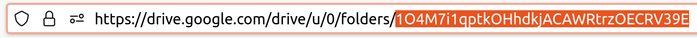

**What is Clowder?**

Clowder is a simple library for SILNLP-job orchestration. Clowder allows you to quickly set up groups of related experiments (called investigations), monitor their progress, and see their results recorded in a single location. 

**Getting Started**

You will need a Google service account and a corresponding credentials file. If you are working within SIL, contact eli_lowry@sil.org if you would like to use the shared internal service account. Otherwise, you can create your own service account and credentials (see [here](https://cloud.google.com/iam/docs/service-accounts-create)). In order to interact with the S3 bucket, you'll also need a proper aws configuration (as specified in the silnlp README).

***Running Clowder***

Enter your silnlp poetry shell (`poetry shell`) and run `clowder list`. (Note: All clowder commands should be run from within your silnlp poetry environment). Don't worry! This command should produce an error saying that 'No Google credentials file' was found. 

***Incorporating your credentials file***

You should now see a directory '.clowder' under the directory in which you just ran the command. Copy-paste your google service account credentials file into this directory. Once you've done so, run `clowder list` again. Now, you should now see empty output since you don't have any existing investigations yet.

***Selecting a context***

Clowder groups investigations within contexts. A context is just a Google drive folder in which investigations will be stored. Clowder can store and maintain information across multiple contexts, but at any given time, Clowder only uses one context. In order to begin managing investigations, you must run `clowder use-context [context]` where `context` is a unique id for the Google folder you wish to use as a parent folder for your investigations. You can see this id in your browser if you navigate to the folder you'd like to be the context folder. 

If you'd like to see the context you're currently using, run `clowder current-context`. 

Note: Make sure that you give your Google service account Editor permissions for the context folder you've selected. If you get 404 file not found errors, it may be a sign that your service account doesn't have proper permissions.

***Creating your first investigation***

Once you've successfully selected a context, you're now poised to create your first investigation. Run `clowder create [investigation-name]`. This might take a few seconds. Once it's completed, run `clowder urlfor [investigation-name]`. Follow the link displayed in the console to view your investigation. Note that it should be a subfolder of the folder you initially selected as your context. 

Your new investigation is initialized with a few key files:
* 'experiments' : This the folder in which the results of each of the individual experiments within this investigation will be stored. 
* 'clowder.log' : This file is for debugging purposes only. It contains information on user interactions with this investigation. THIS FILE SHOULD NOT BE EDITED BY A USER.
* 'clowder.meta.yml' : This file stores metadata on the investigation that allows clowder to not rely on local storage and allow multiple users to track/manage this investigation successfully. THIS FILE SHOULD NOT BE EDITED BY A USER. 
* 'config.yml' : This file is a template for silnlp config files. Using [jinja templating syntax](https://jinja.palletsprojects.com/en/3.1.x/templates/), this parent config template can be rendered into the numerous child experiments.  
* 'investigation' : This spreadsheet is one of your main points of interaction with the investigation process. Notice that it is generated initially with a single sheet called 'ExperimentsSetup'. In this sheet, each row represents an individual experiment. Any number of columns may be added to this sheet which will be used in the config.yml templating mentioned above, but it is generated with a few built-in configuration fields.
  * 'name' : The unique name of this experiment. Choosing a descriptive name will be helpful. 
  * 'entrypoint' : The silnlp script that will be run (e.g. silnlp.nmt.experiment [ARGS]). There are 3 special values that can used in the entrypoints for convenience: $EXP which will be rendered as the location of the experiment as you would typically see after an silnlp.nmt.experiment command (e.g. 'FT-Esperanto/NLLB600test'), $ON_CLEARML which will be rendered as the clearml-queue flag for convenience, and $LOCAL_EXP_DIR which references the path of your local experiments mount (e.g. ~/S/MT/experiments)
  * 'results-csvs' : A semicolon-delimited list of csv filename patterns (e.g. 'scores-1000.csv;corpus_stats.csv') that would typically be outputted by silnlp - these files will be collected across experiments and aggregated in separate sheets within this spreadsheet by filename. Results will automatically be color-coded along columns (red = min, green = max). If you'd rather disable or change the color-coding, you can do so by adding '?[color-mode]' to the end of a given results name. The color modes are: column, row, overall, and nocolor (e.g. 'tokenizer_stats.csv?nocolor'). One pair of special results values that can be used here are 'scores-best' and 'scores-last'. 
  * 'results-clearml-metrics : Similar to above. A semicolon-delimited list of ClearML Summary metric names.

***Exploring further functionality***

Clowder is intended to be intuitive, but if you wonder what any commands do or what commands are available, run `clowder [command] --help` or `clowder --help` to see more information.

***Warning!***

Interrupting a clowder command or manually editing/deleting any of the clowder.meta.ymls, filenames, or directory structures may result in an invalid state. Accidentally editing or deleting files on Google drive may not be rectifiable (unless you can undo your changes successfully), but accidental changes locally, for example to the clowder.master.meta.yml, can usually be fixed by untracking and retracking effected investigations. Please use clowder commands for managing clowder investigations as much as possible. The main points of interaction outside these commands are editing the ExperimentsSetup sheet and the config.yml. Other files may be added to the investigation folder (e.g. notes, results summary, etc.) and other sheets can be added to the investigation spreadsheet safely (as long as there are no naming conflicts), but please do not edit or delete any of the other files.